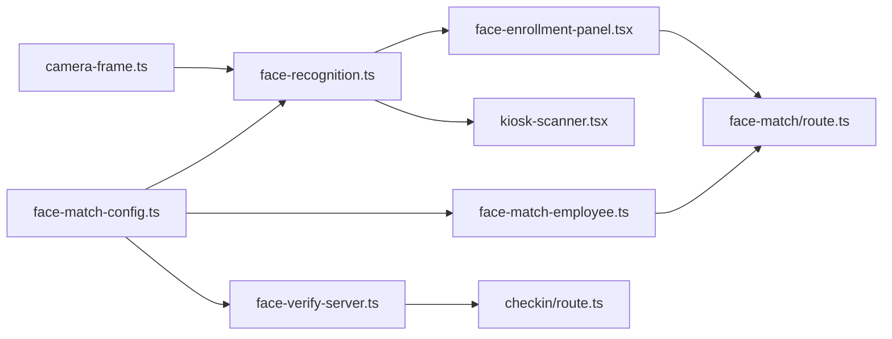

# ارتباطات الملفات — خريطة شاملة

> عند تعديل ملف، راجع الجدول لمعرفة الملفات المرتبطة.

---

## 1. المصادقة والصلاحيات

| الملف | يستورد من | يُستورد في |
|-------|-----------|------------|
| `lib/permissions.ts` | `@prisma/client` (Role) | api-auth · page-auth · role-context · dashboard-nav · صفحات |
| `lib/api-auth.ts` | permissions · prisma · supabase/server | **كل** API routes للوحة |
| `lib/page-auth.ts` | permissions · prisma · supabase/server | صفحات dashboard |
| `middleware.ts` | supabase/ssr | — (Edge) |
| `lib/supabase/client.ts` | @supabase/ssr | login-form · header |
| `lib/supabase/server.ts` | @supabase/ssr | api-auth · page-auth · layout |
| `components/dashboard/role-context.tsx` | permissions | sidebar · mobile-nav · employees-manager |
| `lib/kiosk-auth.ts` | — | attendance API · descriptors API · kiosk pages |
| `lib/auth-cookies.ts` | — | **غير مستخدم** ⚠️ |

---

## 2. التعرف على الوجه

| الملف | الدور | مرتبط بـ |
|-------|-------|----------|
| `lib/face-match-config.ts` | **مصدر الحقيقة** للعتبات | face-recognition · face-verify-server · face-match-employee |
| `lib/face-recognition.ts` | عميل: كشف · مطابقة · تسجيل | kiosk-scanner · face-enrollment-panel · kiosk-warmup |
| `lib/face-verify-server.ts` | خادم: مسافة · تحقق | checkin · checkout · face-match |
| `lib/face-match-employee.ts` | بحث DB | employees routes · descriptors · face-match |
| `lib/face-descriptor-utils.ts` | تصفية بصمات وهمية | face-match-employee · descriptors · employees routes |
| `lib/camera-frame.ts` | فيديو → canvas | face-recognition |
| `public/models/*` | أوزان النماذج | face-recognition (URI: `/models`) |
| `scripts/download-face-models.js` | تحميل النماذج | npm run models:download |

### مسارات API للوجه

```
POST /api/employees/face-match     → findEmployeeByFaceDescriptor (duplicate)
PUT  /api/employees/descriptors    → duplicate + إنشاء موظف كشك
POST /api/employees                → duplicate عند الإنشاء
PUT  /api/employees/[id]           → duplicate عند التحديث
POST /api/attendance/checkin       → verifyFaceDescriptor
POST /api/attendance/checkout      → verifyFaceDescriptor
```

---

## 3. الموظفون

| الملف | الدور |
|-------|-------|
| `app/dashboard/employees/page.tsx` | SSR · requirePagePermission |
| `components/dashboard/employees/employees-manager.tsx` | قائمة · إجراءات |
| `components/dashboard/employees/employee-form-dialog.tsx` | نموذج CRUD |
| `components/dashboard/employees/face-enrollment-panel.tsx` | تسجيل وجه |
| `app/api/employees/route.ts` | GET/POST |
| `app/api/employees/[id]/route.ts` | GET/PUT/DELETE |
| `lib/employee-serialize.ts` | تحويل Prisma → API |
| `lib/employee-validation.ts` | تحقق الأكواد |
| `lib/employee-codes.ts` | EMP### · emergency |
| `lib/employee-types.ts` | أنواع TypeScript |

---

## 4. الحضور

| الملف | الدور |
|-------|-------|
| `app/api/attendance/checkin/route.ts` | تسجيل حضور |
| `app/api/attendance/checkout/route.ts` | تسجيل انصراف |
| `app/api/attendance/emergency/route.ts` | رمز طارئ + rate limit |
| `app/api/attendance/today/route.ts` | حالة اليوم |
| `lib/attendance-utils.ts` | حالة متأخر/مبكر |
| `lib/attendance-shift.ts` | حل الشفت |
| `lib/attendance-reconcile.ts` | مزامنة الحالات |
| `components/kiosk/kiosk-scanner.tsx` | واجهة المسح الكاملة |

---

## 5. التقارير

| الملف | الدور |
|-------|-------|
| `app/dashboard/reports/page.tsx` | SSR |
| `components/dashboard/reports/reports-manager.tsx` | واجهة + تصدير |
| `app/api/reports/route.ts` | تقرير أسبوعي JSON |
| `app/api/reports/employee/route.ts` | تقرير موظف |
| `lib/reports.ts` | استعلامات التقارير |
| `lib/report-export.ts` | واجهة التصدير |
| `lib/export-excel.ts` · `export-pdf.ts` | توليد الملفات |

---

## 6. الإعدادات

| الملف | الدور |
|-------|-------|
| `app/dashboard/settings/page.tsx` | SSR |
| `components/dashboard/settings/shifts-settings.tsx` | شفتات |
| `components/dashboard/settings/departments-settings.tsx` | أقسام |
| `app/api/schedules/route.ts` | CRUD شفتات |
| `app/api/departments/route.ts` | CRUD أقسام |
| `lib/shifts.ts` · `shift-defaults.ts` | شفتات افتراضية |
| `lib/departments.ts` · `department-types.ts` | أقسام |

---

## 7. البنية التحتية

| الملف | الدور |
|-------|-------|
| `lib/prisma.ts` | عميل DB |
| `prisma/schema.prisma` | مخطط |
| `next.config.mjs` | webpack · headers · React fix |
| `vercel.json` | prisma generate · region |
| `middleware.ts` | حماية المسارات |

---

## 8. مخطط تبعيات الوجه (Mermaid)



---

## 9. عند التعديل — ماذا تختبر؟

| إذا عدّلت | اختبر |
|-----------|--------|
| `permissions.ts` | كل الأدوار · API · إخفاء أزرار UI |
| `face-match-config.ts` | كشك حضور · تسجيل مكرر · dashboard enroll |
| `schema.prisma` | db push · build · seed |
| `middleware.ts` | login · dashboard · kiosk (لا يتأثر) |
| `employee-serialize.ts` | قائمة موظفين · لا تسرّب descriptor |
